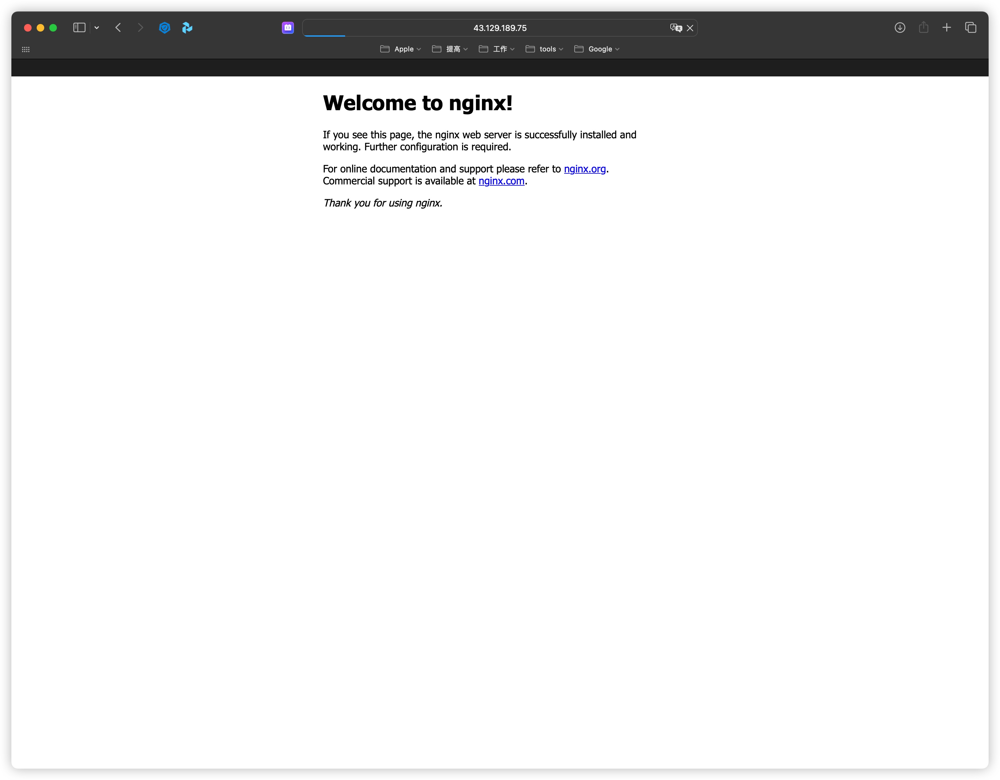

# 请实践 P22 跨集群 Ingress，实现多集群服务访问，并截图
以老师 `iac/week-10/karmada` 代码创建集群
```shell
terraform init && terraform apply

brew install karmadactl

export KUBECONFIG=./config1.yaml && karmadactl init --karmada-data ./data --karmada-pki ./data --karmada-apiserver-advertise-address 43.129.231.101 --cert-external-ip 43.129.231.101

karmadactl --kubeconfig ./data/karmada-apiserver.config join cluster-2 --cluster-kubeconfig=./config2.yaml

karmadactl --kubeconfig ./data/karmada-apiserver.config join cluster-3 --cluster-kubeconfig=./config3.yaml

export KUBECONFIG="$(pwd)/data/karmada-apiserver.config" && kubectl get cluster
NAME        VERSION        MODE   READY   AGE
cluster-2   v1.28.1+k3s1   Push   True    51s
cluster-3   v1.28.1+k3s1   Push   True    10s

```

## Multi-cluster Ingress
### Download code
```shell
cd karmada
# for HTTPS
git clone https://github.com/karmada-io/multi-cluster-ingress-nginx.git
```
### deploy ingress-nginx
```shell
kubectl create namespace ingress-nginx

cat << EOF | helm template ingress-nginx ./multi-cluster-ingress-nginx/charts/ingress-nginx --namespace=ingress-nginx --values - | kubectl apply -n ingress-nginx --validate=false -f -
controller:
  image:
    repository: sawyer523/controller
    tag: v1.1.1
  config:
    worker-processes: "1"
  podLabels:
    deploy-date: "$(date +%s)"
  updateStrategy:
    type: RollingUpdate
    rollingUpdate:
      maxUnavailable: 1
  hostPort:
    enabled: true
  terminationGracePeriodSeconds: 0
  service:
    type: NodePort
EOF
```

### Apply kubeconfig secret
```shell
kubectl -n ingress-nginx create secret generic kubeconfig --from-file=kubeconfig=./karmada/data/karmada-apiserver.config
```

### Edit ingress-nginx-controller deployment
```shell
kubectl -n ingress-nginx edit deployment ingress-nginx-controller

Edit as follows:

apiVersion: apps/v1
kind: Deployment
metadata:
  ...
spec:
  #...
  template:
    spec:
      containers:
      - args:
        - /nginx-ingress-controller
        - --karmada-kubeconfig=/etc/kubeconfig  # new line
        #...
        volumeMounts:
        #...
        - mountPath: /etc/kubeconfig            # new line
          name: kubeconfig                      # new line
          subPath: kubeconfig                   # new line
      volumes:
      #...
      - name: kubeconfig                        # new line
        secret:                                 # new line
          secretName: kubeconfig                # new line
```

### Deploy web on cluster-2 cluster
```shell
kubectl apply -f yaml/deploy.yaml
```

### Export web service from cluster-2 cluster
```shell
kubectl apply -f yaml/service-export.yaml
```

### Import web service to cluster-3 cluster
```shell
kubectl apply -f yaml/service-import.yaml
```

### Deploy multiclusteringress on karmada-controlplane
```shell
kubectl apply -f yaml/mci-web.yaml
```

### Local testing
```shell
kubectl port-forward --namespace=ingress-nginx service/ingress-nginx-controller 8080:80
```

# 请实践 P47 Velero Hooks，并实现备份开始时冻结 IO，备份结束后结束冻结，并截图
使用 terraform 创建了 cos
```shell
❯ terraform apply -auto-approve
module.cos.data.tencentcloud_user_info.cos: Reading...
module.cos.data.tencentcloud_user_info.cos: Read complete after 1s [id=user-100033162063-1320638289-1847]

Terraform used the selected providers to generate the following execution plan. Resource actions are indicated with the following symbols:
  + create

Terraform will perform the following actions:

  # module.cos.tencentcloud_cos_bucket.cos will be created
  + resource "tencentcloud_cos_bucket" "cos" {
      + acceleration_enable = false
      + acl                 = "private"
      + bucket              = "velero-cos-1320638289"
      + cos_bucket_url      = (known after apply)
      + force_clean         = false
      + id                  = (known after apply)
      + log_enable          = false
      + log_prefix          = (known after apply)
      + log_target_bucket   = (known after apply)
      + versioning_enable   = false
    }

Plan: 1 to add, 0 to change, 0 to destroy.

Changes to Outputs:
  + bucket_name = "velero-cos-1320638289"
  + endpoint    = (known after apply)
module.cos.tencentcloud_cos_bucket.cos: Creating...
module.cos.tencentcloud_cos_bucket.cos: Still creating... [10s elapsed]
module.cos.tencentcloud_cos_bucket.cos: Creation complete after 17s [id=velero-cos-1320638289]

Apply complete! Resources: 1 added, 0 changed, 0 destroyed.

Outputs:

bucket_name = "velero-cos-1320638289"
endpoint = "https://velero-cos-1320638289.cos.ap-hongkong.myqcloud.com"
```

1. 安装 velero
    ```shell
    velero install --provider aws --plugins velero/velero-plugin-for-aws:v1.2.1 \
    --use-node-agent \
    --default-volumes-to-fs-backup=true \
    --secret-file ./credentials-velero \
    --use-volume-snapshots=false \
    --bucket velero-cos-1320638289 \
    --backup-location-config region=ap-hongkong,s3ForcePathStyle="true",s3Url=https://cos.ap-hongkong.myqcloud.com
    ```

1. 部署 nginx
    ```shell
    kubectl apply -f deployment-with-pv.yaml
    ```

1. 访问
    ```shell
    for i in {1..10}; do curl 43.129.189.75:30080; done
    ```

1. 查看日志
    ```shell
     kubectl exec -it $(kubectl get pods -l app=nginx -o jsonpath='{.items[0].metadata.name}' -n nginx) -n nginx -- cat /var/log/nginx/access.log
    Defaulted container "nginx" out of: nginx, fsfreeze
    10.42.0.1 - - [23/Nov/2023:17:22:47 +0000] "GET / HTTP/1.1" 200 612 "-" "Mozilla/5.0 (Macintosh; Intel Mac OS X 10_15_7) AppleWebKit/605.1.15 (KHTML, like Gecko) Version/17.2 Safari/605.1.15" "-"
    10.42.0.1 - - [23/Nov/2023:17:22:47 +0000] "GET /favicon.ico HTTP/1.1" 404 153 "http://43.129.189.75:30080/" "Mozilla/5.0 (Macintosh; Intel Mac OS X 10_15_7) AppleWebKit/605.1.15 (KHTML, like Gecko) Version/17.2 Safari/605.1.15" "-"
    10.42.0.1 - - [23/Nov/2023:17:22:50 +0000] "GET / HTTP/1.1" 200 612 "-" "Mozilla/5.0 (Macintosh; Intel Mac OS X 10_15_7) AppleWebKit/605.1.15 (KHTML, like Gecko) Version/17.2 Safari/605.1.15" "-"
    10.42.0.1 - - [23/Nov/2023:17:22:50 +0000] "GET / HTTP/1.1" 200 612 "-" "Mozilla/5.0 (Macintosh; Intel Mac OS X 10_15_7) AppleWebKit/605.1.15 (KHTML, like Gecko) Version/17.2 Safari/605.1.15" "-"
    10.42.0.1 - - [23/Nov/2023:17:22:50 +0000] "GET / HTTP/1.1" 200 612 "-" "Mozilla/5.0 (Macintosh; Intel Mac OS X 10_15_7) AppleWebKit/605.1.15 (KHTML, like Gecko) Version/17.2 Safari/605.1.15" "-"
    10.42.0.1 - - [23/Nov/2023:17:22:51 +0000] "GET / HTTP/1.1" 200 612 "-" "Mozilla/5.0 (Macintosh; Intel Mac OS X 10_15_7) AppleWebKit/605.1.15 (KHTML, like Gecko) Version/17.2 Safari/605.1.15" "-"
    10.42.0.1 - - [23/Nov/2023:17:22:51 +0000] "GET / HTTP/1.1" 200 612 "-" "Mozilla/5.0 (Macintosh; Intel Mac OS X 10_15_7) AppleWebKit/605.1.15 (KHTML, like Gecko) Version/17.2 Safari/605.1.15" "-"
    10.42.0.1 - - [23/Nov/2023:17:22:51 +0000] "GET / HTTP/1.1" 200 612 "-" "Mozilla/5.0 (Macintosh; Intel Mac OS X 10_15_7) AppleWebKit/605.1.15 (KHTML, like Gecko) Version/17.2 Safari/605.1.15" "-"
    10.42.0.1 - - [23/Nov/2023:17:22:51 +0000] "GET / HTTP/1.1" 200 612 "-" "Mozilla/5.0 (Macintosh; Intel Mac OS X 10_15_7) AppleWebKit/605.1.15 (KHTML, like Gecko) Version/17.2 Safari/605.1.15" "-"
    10.42.0.1 - - [23/Nov/2023:17:22:51 +0000] "GET / HTTP/1.1" 200 612 "-" "Mozilla/5.0 (Macintosh; Intel Mac OS X 10_15_7) AppleWebKit/605.1.15 (KHTML, like Gecko) Version/17.2 Safari/605.1.15" "-"
    10.42.0.1 - - [23/Nov/2023:17:22:51 +0000] "GET / HTTP/1.1" 200 612 "-" "Mozilla/5.0 (Macintosh; Intel Mac OS X 10_15_7) AppleWebKit/605.1.15 (KHTML, like Gecko) Version/17.2 Safari/605.1.15" "-"
    10.42.0.1 - - [23/Nov/2023:17:22:52 +0000] "GET / HTTP/1.1" 200 612 "-" "Mozilla/5.0 (Macintosh; Intel Mac OS X 10_15_7) AppleWebKit/605.1.15 (KHTML, like Gecko) Version/17.2 Safari/605.1.15" "-"
    10.42.0.1 - - [23/Nov/2023:17:22:52 +0000] "GET / HTTP/1.1" 200 612 "-" "Mozilla/5.0 (Macintosh; Intel Mac OS X 10_15_7) AppleWebKit/605.1.15 (KHTML, like Gecko) Version/17.2 Safari/605.1.15" "-"
    10.42.0.1 - - [23/Nov/2023:17:22:53 +0000] "GET / HTTP/1.1" 200 612 "-" "Mozilla/5.0 (Macintosh; Intel Mac OS X 10_15_7) AppleWebKit/605.1.15 (KHTML, like Gecko) Version/17.2 Safari/605.1.15" "-"
    10.42.0.1 - - [23/Nov/2023:17:22:53 +0000] "GET / HTTP/1.1" 200 612 "-" "Mozilla/5.0 (Macintosh; Intel Mac OS X 10_15_7) AppleWebKit/605.1.15 (KHTML, like Gecko) Version/17.2 Safari/605.1.15" "-"
    10.42.0.1 - - [23/Nov/2023:17:22:53 +0000] "GET / HTTP/1.1" 200 612 "-" "Mozilla/5.0 (Macintosh; Intel Mac OS X 10_15_7) AppleWebKit/605.1.15 (KHTML, like Gecko) Version/17.2 Safari/605.1.15" "-"
    10.42.0.1 - - [23/Nov/2023:17:22:53 +0000] "GET / HTTP/1.1" 200 612 "-" "Mozilla/5.0 (Macintosh; Intel Mac OS X 10_15_7) AppleWebKit/605.1.15 (KHTML, like Gecko) Version/17.2 Safari/605.1.15" "-"
    10.42.0.1 - - [23/Nov/2023:17:22:53 +0000] "GET / HTTP/1.1" 200 612 "-" "Mozilla/5.0 (Macintosh; Intel Mac OS X 10_15_7) AppleWebKit/605.1.15 (KHTML, like Gecko) Version/17.2 Safari/605.1.15" "-"
    10.42.0.1 - - [23/Nov/2023:17:22:54 +0000] "GET / HTTP/1.1" 200 612 "-" "Mozilla/5.0 (Macintosh; Intel Mac OS X 10_15_7) AppleWebKit/605.1.15 (KHTML, like Gecko) Version/17.2 Safari/605.1.15" "-"
    10.42.0.1 - - [23/Nov/2023:17:22:54 +0000] "GET / HTTP/1.1" 200 612 "-" "Mozilla/5.0 (Macintosh; Intel Mac OS X 10_15_7) AppleWebKit/605.1.15 (KHTML, like Gecko) Version/17.2 Safari/605.1.15" "-"
    10.42.0.1 - - [23/Nov/2023:17:22:54 +0000] "GET / HTTP/1.1" 200 612 "-" "Mozilla/5.0 (Macintosh; Intel Mac OS X 10_15_7) AppleWebKit/605.1.15 (KHTML, like Gecko) Version/17.2 Safari/605.1.15" "-"
    10.42.0.1 - - [23/Nov/2023:17:22:54 +0000] "GET / HTTP/1.1" 200 612 "-" "Mozilla/5.0 (Macintosh; Intel Mac OS X 10_15_7) AppleWebKit/605.1.15 (KHTML, like Gecko) Version/17.2 Safari/605.1.15" "-"
    10.42.0.1 - - [23/Nov/2023:17:22:55 +0000] "GET / HTTP/1.1" 200 612 "-" "Mozilla/5.0 (Macintosh; Intel Mac OS X 10_15_7) AppleWebKit/605.1.15 (KHTML, like Gecko) Version/17.2 Safari/605.1.15" "-"
    10.42.0.1 - - [23/Nov/2023:17:22:55 +0000] "GET / HTTP/1.1" 200 612 "-" "Mozilla/5.0 (Macintosh; Intel Mac OS X 10_15_7) AppleWebKit/605.1.15 (KHTML, like Gecko) Version/17.2 Safari/605.1.15" "-"
    10.42.0.1 - - [23/Nov/2023:17:23:51 +0000] "GET / HTTP/1.1" 200 612 "-" "curl/8.4.0" "-"
    10.42.0.1 - - [23/Nov/2023:17:23:51 +0000] "GET / HTTP/1.1" 200 612 "-" "curl/8.4.0" "-"
    10.42.0.1 - - [23/Nov/2023:17:23:52 +0000] "GET / HTTP/1.1" 200 612 "-" "curl/8.4.0" "-"
    10.42.0.1 - - [23/Nov/2023:17:23:52 +0000] "GET / HTTP/1.1" 200 612 "-" "curl/8.4.0" "-"
    10.42.0.1 - - [23/Nov/2023:17:23:52 +0000] "GET / HTTP/1.1" 200 612 "-" "curl/8.4.0" "-"
    10.42.0.1 - - [23/Nov/2023:17:23:52 +0000] "GET / HTTP/1.1" 200 612 "-" "curl/8.4.0" "-"
    10.42.0.1 - - [23/Nov/2023:17:23:52 +0000] "GET / HTTP/1.1" 200 612 "-" "curl/8.4.0" "-"
    10.42.0.1 - - [23/Nov/2023:17:23:53 +0000] "GET / HTTP/1.1" 200 612 "-" "curl/8.4.0" "-"
    10.42.0.1 - - [23/Nov/2023:17:23:53 +0000] "GET / HTTP/1.1" 200 612 "-" "curl/8.4.0" "-"
    10.42.0.1 - - [23/Nov/2023:17:23:53 +0000] "GET / HTTP/1.1" 200 612 "-" "curl/8.4.0" "-"
    
    ```

1. 备份灾备(备份 nginx NS 以及持久卷):
    ```shell
    velero backup create my-cluster --default-volumes-to-fs-backup=true --include-namespaces=nginx 
    # 查看备份状态: 
    ❯ velero backup describe my-cluster
An error occurred: the server was unable to return a response in the time allotted, but may still be processing the request (get backups.velero.io my-cluster)
    ```
ng 无法访问

