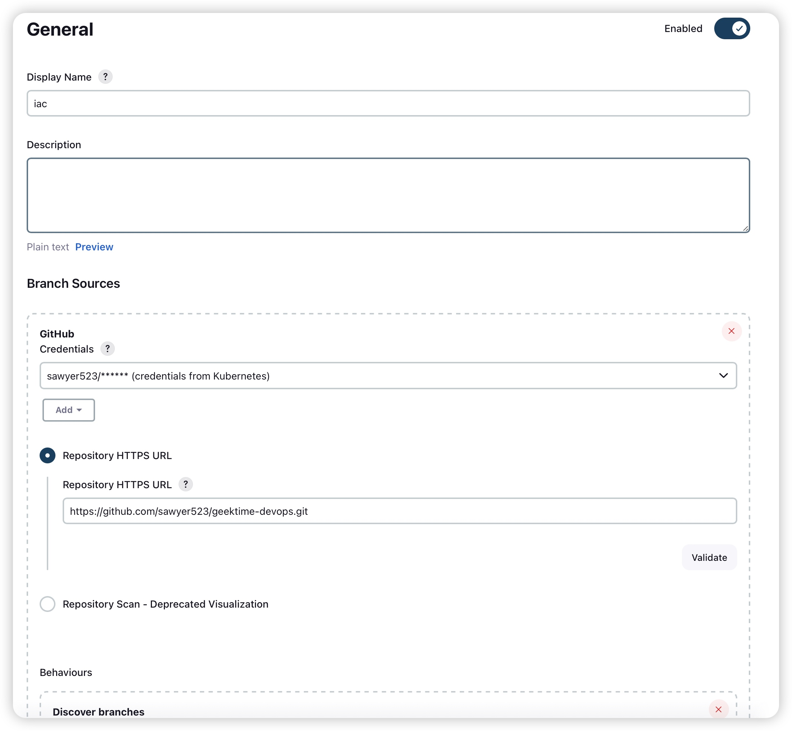

# 训练营课程大作业
1. 使用 Terraform 开通一台腾讯云 CVM, 安装 K3s(集群 1), 并在集群 1 内安装 Jenkins、Argo CD
2. 书写 Terraform lac 代码: 开通两台腾讯云 CVM, 分别安装 K3s(集群 2、集群 3), 并实现以下要求:
    * 使用集群 1 作为 Terraform Kubernetes backend 后端存储
    * 将 laC 源码存储在 GitHub 代码仓库中
    * 在集群 1 的 Jenkins 中配置流水线, 实现在 lac 代码变更时自动触发变更 (Jenkinsfile)
3. 在集群 1 的 Argo CD 实例中添加集群 2、3
4. 使用一个 ApplicationSet +List Generators 在集群 2、集群 3 内的 default 命名空间下同时部署示例应用 Bookinfo(Helm Chart 源码见: iac/lastwork/bookinfo)
5. 示例应用部署完成后，实现以下架构：


## 备注
这是一个理想的多云灾备部署场景, 集群 1、2、3 可能分别部署在不同云厂商。集群 1 的 Proxy 作为流量入口对外提供服务，对部署在集群 2 和集群 3 的无状态示例应用 Bookinfo 做负载均衡。

## 实现
1. 使用 Terraform 拉进起环境
    ```shell
    terraform init
    terraform apply --auto-approve
    ```

1. 等待 crossplane provider 部署完成后，查看 crossplane provider 状态
    ```shell
    kubectl get provider
    NAME                 INSTALLED   HEALTHY   PACKAGE                                              AGE
    provider-terraform   True        True      xpkg.upbound.io/upbound/provider-terraform:v0.11.0   2m
    ```

1. 部署 provoder config
    ```shell
    kubectl apply -f yaml/tf-provider-config.yaml
    ```

1. 等待环境完成后，Agro CD 中部署了 ApplicationSet

1. 登陆 Jenkins，配置 Iac 工程
    
    

1. 登陆 GitHub 配置 webhook
    

1. 提交 iac 代码触发构建，建立新集群
    
    

1. 等待 Terraform 部署完成
    ```shell
    ❯ k get workspace
    NAME    READY   SYNCED   AGE
    k3s-3   True    True     15m
    k3s-2   True    True     15m
    ❯ k get workspace k3s-2 -o yaml | yq .status.atProvider.outputs.public_ip
    124.156.160.164
    ❯ k get workspace k3s-3 -o yaml | yq .status.atProvider.outputs.public_ip
    43.128.24.229
    ```

1. 分别登陆到每台新建的机器上获取到 config.yaml 文件，并用 argocli 添加新集群到 argocd 中
    ```shell
    ❯ argocd cluster add default --cluster-endpoint=config2.yaml --kubeconfig=config2.yaml --name=k8s-2
    WARNING: This will create a service account `argocd-manager` on the cluster referenced by context `default` with full cluster level privileges. Do you want to continue [y/N]? y
    INFO[0002] ServiceAccount "argocd-manager" created in namespace "kube-system" 
    INFO[0002] ClusterRole "argocd-manager-role" created    
    INFO[0002] ClusterRoleBinding "argocd-manager-role-binding" created 
    INFO[0008] Created bearer token secret for ServiceAccount "argocd-manager" 
    Cluster 'https://124.156.160.164:6443' added
    ❯ argocd cluster add default --cluster-endpoint=config3.yaml --kubeconfig=config3.yaml --name=k8s-3
    WARNING: This will create a service account `argocd-manager` on the cluster referenced by context `default` with full cluster level privileges. Do you want to continue [y/N]? y
    INFO[0002] ServiceAccount "argocd-manager" created in namespace "kube-system" 
    INFO[0002] ClusterRole "argocd-manager-role" created    
    INFO[0002] ClusterRoleBinding "argocd-manager-role-binding" created 
    INFO[0008] Created bearer token secret for ServiceAccount "argocd-manager" 
    Cluster 'https://43.128.24.229:6443' added
    ```
    

1. 给每个集群添加 label use=prod，等待自动部署 bookinfo 完成
    

1. 部署 ingress + HAProxy 实现流量负载均衡 (加权轮询)，自动故障转移
    ```shell
    kubectl apply -f haproxy
    ```

1. 等待 HAProxy 部署完成后，测试
    ```shell
    for i in {1..10}; do curl http://43.129.235.21 -H "Host: bookinfo.example.local" -v; done
    ```

1. 查看两台集群的 productpage 日志
    ```shell
    export KUBECONFIG=./config2.yaml
    k logs productpage-v1-675fc69cf-mkzmf -f
    INFO:root:start at port 9080
     * Serving Flask app 'productpage' (lazy loading)
     * Environment: production
       WARNING: This is a development server. Do not use it in a production deployment.
       Use a production WSGI server instead.
     * Debug mode: on
    INFO:werkzeug:WARNING: This is a development server. Do not use it in a production deployment. Use a production WSGI server instead.
     * Running on all addresses (::)
     * Running on http://[::1]:9080
     * Running on http://[::1]:9080
    INFO:werkzeug:Press CTRL+C to quit
    INFO:werkzeug: * Restarting with stat
    INFO:root:start at port 9080
    WARNING:werkzeug: * Debugger is active!
    INFO:werkzeug: * Debugger PIN: 716-601-183
    INFO:werkzeug:::ffff:10.98.0.24 - - [10/Dec/2023 08:57:03] "GET / HTTP/1.1" 200 -
    INFO:werkzeug:::ffff:10.98.0.24 - - [10/Dec/2023 08:57:05] "GET / HTTP/1.1" 200 -
    INFO:werkzeug:::ffff:10.98.0.24 - - [10/Dec/2023 08:57:07] "GET / HTTP/1.1" 200 -
    INFO:werkzeug:::ffff:10.98.0.24 - - [10/Dec/2023 08:57:09] "GET / HTTP/1.1" 200 -
    INFO:werkzeug:::ffff:10.98.0.24 - - [10/Dec/2023 08:57:11] "GET / HTTP/1.1" 200 -
    INFO:werkzeug:::ffff:10.98.0.24 - - [10/Dec/2023 08:57:13] "GET / HTTP/1.1" 200 -
    INFO:werkzeug:::ffff:10.98.0.24 - - [10/Dec/2023 08:57:15] "GET / HTTP/1.1" 200 -
    INFO:werkzeug:::ffff:10.98.0.24 - - [10/Dec/2023 08:57:17] "GET / HTTP/1.1" 200 -
    INFO:werkzeug:::ffff:10.98.0.24 - - [10/Dec/2023 08:57:19] "GET / HTTP/1.1" 200 -
    INFO:werkzeug:::ffff:10.98.0.24 - - [10/Dec/2023 08:57:21] "GET / HTTP/1.1" 200 -
    INFO:werkzeug:::ffff:10.98.0.24 - - [10/Dec/2023 08:57:23] "GET / HTTP/1.1" 200 -
    INFO:werkzeug:::ffff:10.98.0.24 - - [10/Dec/2023 08:57:25] "GET / HTTP/1.1" 200 -
    INFO:werkzeug:::ffff:10.98.0.24 - - [10/Dec/2023 08:57:27] "GET / HTTP/1.1" 200 -
    INFO:werkzeug:::ffff:10.98.0.24 - - [10/Dec/2023 08:57:29] "GET / HTTP/1.1" 200 -
    INFO:werkzeug:::ffff:10.98.0.24 - - [10/Dec/2023 08:57:31] "GET / HTTP/1.1" 200 -
    INFO:werkzeug:::ffff:10.98.0.24 - - [10/Dec/2023 08:57:33] "GET / HTTP/1.1" 200 -
    INFO:werkzeug:::ffff:10.98.0.24 - - [10/Dec/2023 08:57:35] "GET / HTTP/1.1" 200 -
    INFO:werkzeug:::ffff:10.98.0.24 - - [10/Dec/2023 08:57:37] "GET / HTTP/1.1" 200 -
    INFO:werkzeug:::ffff:10.98.0.24 - - [10/Dec/2023 08:57:39] "GET / HTTP/1.1" 200 -
    INFO:werkzeug:::ffff:10.98.0.24 - - [10/Dec/2023 08:57:41] "GET / HTTP/1.1" 200 -
    INFO:werkzeug:::ffff:10.98.0.24 - - [10/Dec/2023 08:57:43] "GET / HTTP/1.1" 200 -
    INFO:werkzeug:::ffff:10.98.0.24 - - [10/Dec/2023 08:57:45] "GET / HTTP/1.1" 200 -
    INFO:werkzeug:::ffff:10.98.0.24 - - [10/Dec/2023 08:57:47] "GET / HTTP/1.1" 200 -
    INFO:werkzeug:::ffff:10.98.0.24 - - [10/Dec/2023 08:57:49] "GET / HTTP/1.1" 200 -
    INFO:werkzeug:::ffff:10.98.0.24 - - [10/Dec/2023 08:57:51] "GET / HTTP/1.1" 200 -
    INFO:werkzeug:::ffff:10.98.0.24 - - [10/Dec/2023 08:57:53] "GET / HTTP/1.1" 200 -
    INFO:werkzeug:::ffff:10.98.0.24 - - [10/Dec/2023 08:57:55] "GET / HTTP/1.1" 200 -
    INFO:werkzeug:::ffff:10.98.0.24 - - [10/Dec/2023 08:57:57] "GET / HTTP/1.1" 200 -
    INFO:werkzeug:::ffff:10.98.0.24 - - [10/Dec/2023 08:57:59] "GET / HTTP/1.1" 200 -
    INFO:werkzeug:::ffff:10.98.0.24 - - [10/Dec/2023 08:58:01] "GET / HTTP/1.1" 200 -
    INFO:werkzeug:::ffff:10.98.0.24 - - [10/Dec/2023 08:58:03] "GET / HTTP/1.1" 200 -
    INFO:werkzeug:::ffff:10.98.0.24 - - [10/Dec/2023 08:58:05] "GET / HTTP/1.1" 200 -
    INFO:werkzeug:::ffff:10.98.0.24 - - [10/Dec/2023 08:58:06] "GET / HTTP/1.1" 200 -
    INFO:werkzeug:::ffff:10.98.0.24 - - [10/Dec/2023 08:58:07] "GET / HTTP/1.1" 200 -
    INFO:werkzeug:::ffff:10.98.0.24 - - [10/Dec/2023 08:58:09] "GET / HTTP/1.1" 200 -
    INFO:werkzeug:::ffff:10.98.0.24 - - [10/Dec/2023 08:58:09] "GET / HTTP/1.1" 200 -
    INFO:werkzeug:::ffff:10.98.0.24 - - [10/Dec/2023 08:58:10] "GET / HTTP/1.1" 200 -
    INFO:werkzeug:::ffff:10.98.0.24 - - [10/Dec/2023 08:58:11] "GET / HTTP/1.1" 200 -
    INFO:werkzeug:::ffff:10.98.0.24 - - [10/Dec/2023 08:58:11] "GET / HTTP/1.1" 200 -
    INFO:werkzeug:::ffff:10.98.0.24 - - [10/Dec/2023 08:58:12] "GET / HTTP/1.1" 200 -
    INFO:werkzeug:::ffff:10.98.0.24 - - [10/Dec/2023 08:58:13] "GET / HTTP/1.1" 200 -
    INFO:werkzeug:::ffff:10.98.0.24 - - [10/Dec/2023 08:58:13] "GET / HTTP/1.1" 200 -
    INFO:werkzeug:::ffff:10.98.0.24 - - [10/Dec/2023 08:58:13] "GET / HTTP/1.1" 200 -
    INFO:werkzeug:::ffff:10.98.0.24 - - [10/Dec/2023 08:58:14] "GET / HTTP/1.1" 200 -
    INFO:werkzeug:::ffff:10.98.0.24 - - [10/Dec/2023 08:58:15] "GET / HTTP/1.1" 200 -
    INFO:werkzeug:::ffff:10.98.0.24 - - [10/Dec/2023 08:58:15] "GET / HTTP/1.1" 200 -
    INFO:werkzeug:::ffff:10.98.0.24 - - [10/Dec/2023 08:58:16] "GET / HTTP/1.1" 200 -
    INFO:werkzeug:::ffff:10.98.0.24 - - [10/Dec/2023 08:58:17] "GET / HTTP/1.1" 200 -
    INFO:werkzeug:::ffff:10.98.0.24 - - [10/Dec/2023 08:58:19] "GET / HTTP/1.1" 200 -
    INFO:werkzeug:::ffff:10.98.0.24 - - [10/Dec/2023 08:58:21] "GET / HTTP/1.1" 200 -
    INFO:werkzeug:::ffff:10.98.0.24 - - [10/Dec/2023 08:58:23] "GET / HTTP/1.1" 200 -
    INFO:werkzeug:::ffff:10.98.0.24 - - [10/Dec/2023 08:58:25] "GET / HTTP/1.1" 200 -
    INFO:werkzeug:::ffff:10.98.0.24 - - [10/Dec/2023 08:58:27] "GET / HTTP/1.1" 200 -
    ...
    ```
    ```shell
    export KUBECONFIG=./config3.yaml
    k logs productpage-v1-675fc69cf-4587z -f
    INFO:root:start at port 9080
     * Serving Flask app 'productpage' (lazy loading)
     * Environment: production
       WARNING: This is a development server. Do not use it in a production deployment.
       Use a production WSGI server instead.
     * Debug mode: on
    INFO:werkzeug:WARNING: This is a development server. Do not use it in a production deployment. Use a production WSGI server instead.
     * Running on all addresses (::)
     * Running on http://[::1]:9080
     * Running on http://[::1]:9080
    INFO:werkzeug:Press CTRL+C to quit
    INFO:werkzeug: * Restarting with stat
    INFO:root:start at port 9080
    WARNING:werkzeug: * Debugger is active!
    INFO:werkzeug: * Debugger PIN: 106-274-489
    INFO:werkzeug:::ffff:10.98.0.24 - - [10/Dec/2023 08:57:04] "GET / HTTP/1.1" 200 -
    INFO:werkzeug:::ffff:10.98.0.24 - - [10/Dec/2023 08:57:06] "GET / HTTP/1.1" 200 -
    INFO:werkzeug:::ffff:10.98.0.24 - - [10/Dec/2023 08:57:08] "GET / HTTP/1.1" 200 -
    INFO:werkzeug:::ffff:10.98.0.24 - - [10/Dec/2023 08:57:10] "GET / HTTP/1.1" 200 -
    INFO:werkzeug:::ffff:10.98.0.24 - - [10/Dec/2023 08:57:12] "GET / HTTP/1.1" 200 -
    INFO:werkzeug:::ffff:10.98.0.24 - - [10/Dec/2023 08:57:14] "GET / HTTP/1.1" 200 -
    INFO:werkzeug:::ffff:10.98.0.24 - - [10/Dec/2023 08:57:16] "GET / HTTP/1.1" 200 -
    INFO:werkzeug:::ffff:10.98.0.24 - - [10/Dec/2023 08:57:18] "GET / HTTP/1.1" 200 -
    INFO:werkzeug:::ffff:10.98.0.24 - - [10/Dec/2023 08:57:20] "GET / HTTP/1.1" 200 -
    INFO:werkzeug:::ffff:10.98.0.24 - - [10/Dec/2023 08:57:22] "GET / HTTP/1.1" 200 -
    INFO:werkzeug:::ffff:10.98.0.24 - - [10/Dec/2023 08:57:24] "GET / HTTP/1.1" 200 -
    INFO:werkzeug:::ffff:10.98.0.24 - - [10/Dec/2023 08:57:26] "GET / HTTP/1.1" 200 -
    INFO:werkzeug:::ffff:10.98.0.24 - - [10/Dec/2023 08:57:28] "GET / HTTP/1.1" 200 -
    INFO:werkzeug:::ffff:10.98.0.24 - - [10/Dec/2023 08:57:30] "GET / HTTP/1.1" 200 -
    INFO:werkzeug:::ffff:10.98.0.24 - - [10/Dec/2023 08:57:32] "GET / HTTP/1.1" 200 -
    INFO:werkzeug:::ffff:10.98.0.24 - - [10/Dec/2023 08:57:34] "GET / HTTP/1.1" 200 -
    INFO:werkzeug:::ffff:10.98.0.24 - - [10/Dec/2023 08:57:36] "GET / HTTP/1.1" 200 -
    INFO:werkzeug:::ffff:10.98.0.24 - - [10/Dec/2023 08:57:38] "GET / HTTP/1.1" 200 -
    INFO:werkzeug:::ffff:10.98.0.24 - - [10/Dec/2023 08:57:40] "GET / HTTP/1.1" 200 -
    INFO:werkzeug:::ffff:10.98.0.24 - - [10/Dec/2023 08:57:42] "GET / HTTP/1.1" 200 -
    INFO:werkzeug:::ffff:10.98.0.24 - - [10/Dec/2023 08:57:44] "GET / HTTP/1.1" 200 -
    INFO:werkzeug:::ffff:10.98.0.24 - - [10/Dec/2023 08:57:46] "GET / HTTP/1.1" 200 -
    INFO:werkzeug:::ffff:10.98.0.24 - - [10/Dec/2023 08:57:48] "GET / HTTP/1.1" 200 -
    INFO:werkzeug:::ffff:10.98.0.24 - - [10/Dec/2023 08:57:50] "GET / HTTP/1.1" 200 -
    INFO:werkzeug:::ffff:10.98.0.24 - - [10/Dec/2023 08:57:52] "GET / HTTP/1.1" 200 -
    INFO:werkzeug:::ffff:10.98.0.24 - - [10/Dec/2023 08:57:54] "GET / HTTP/1.1" 200 -
    INFO:werkzeug:::ffff:10.98.0.24 - - [10/Dec/2023 08:57:56] "GET / HTTP/1.1" 200 -
    INFO:werkzeug:::ffff:10.98.0.24 - - [10/Dec/2023 08:57:58] "GET / HTTP/1.1" 200 -
    INFO:werkzeug:::ffff:10.98.0.24 - - [10/Dec/2023 08:58:00] "GET / HTTP/1.1" 200 -
    INFO:werkzeug:::ffff:10.98.0.24 - - [10/Dec/2023 08:58:02] "GET / HTTP/1.1" 200 -
    INFO:werkzeug:::ffff:10.98.0.24 - - [10/Dec/2023 08:58:04] "GET / HTTP/1.1" 200 -
    INFO:werkzeug:::ffff:10.98.0.24 - - [10/Dec/2023 08:58:06] "GET / HTTP/1.1" 200 -
    INFO:werkzeug:::ffff:10.98.0.24 - - [10/Dec/2023 08:58:08] "GET / HTTP/1.1" 200 -
    INFO:werkzeug:::ffff:10.98.0.24 - - [10/Dec/2023 08:58:10] "GET / HTTP/1.1" 200 -
    INFO:werkzeug:::ffff:10.98.0.24 - - [10/Dec/2023 08:58:12] "GET / HTTP/1.1" 200 -
    INFO:werkzeug:::ffff:10.98.0.24 - - [10/Dec/2023 08:58:12] "GET / HTTP/1.1" 200 -
    INFO:werkzeug:::ffff:10.98.0.24 - - [10/Dec/2023 08:58:14] "GET / HTTP/1.1" 200 -
    INFO:werkzeug:::ffff:10.98.0.24 - - [10/Dec/2023 08:58:15] "GET / HTTP/1.1" 200 -
    INFO:werkzeug:::ffff:10.98.0.24 - - [10/Dec/2023 08:58:16] "GET / HTTP/1.1" 200 -
    INFO:werkzeug:::ffff:10.98.0.24 - - [10/Dec/2023 08:58:18] "GET / HTTP/1.1" 200 -
    INFO:werkzeug:::ffff:10.98.0.24 - - [10/Dec/2023 08:58:20] "GET / HTTP/1.1" 200 -
    INFO:werkzeug:::ffff:10.98.0.24 - - [10/Dec/2023 08:58:22] "GET / HTTP/1.1" 200 -
    INFO:werkzeug:::ffff:10.98.0.24 - - [10/Dec/2023 08:58:24] "GET / HTTP/1.1" 200 -
    INFO:werkzeug:::ffff:10.98.0.24 - - [10/Dec/2023 08:58:26] "GET / HTTP/1.1" 200 -
    INFO:werkzeug:::ffff:10.98.0.24 - - [10/Dec/2023 08:58:28] "GET / HTTP/1.1" 200 -
    ```

1. 查看 HAProxy controller 日志
    ```shell
    ❯ k logs haproxy-deployment-76556fc989-8mpkj -f
    [NOTICE]   (1) : New worker (9) forked
    [NOTICE]   (1) : Loading success.
    [NOTICE]   (9) : haproxy version is 2.9.0-fddb8c1
    [NOTICE]   (9) : path to executable is /usr/local/sbin/haproxy
    [WARNING]  (9) : [haproxy.main()] Failed to drop supplementary groups. Using 'gid'/'group' without 'uid'/'user' is generally useless.
    10.0.0.28:43296 [10/Dec/2023:08:58:06.601] http_front http_back/cluster2 0/0/1/4/5 200 1804 - - ---- 1/1/0/0/0 0/0 "GET / HTTP/1.1"
    10.0.0.28:38386 [10/Dec/2023:08:58:09.611] http_front http_back/cluster2 0/0/1/4/5 200 1804 - - ---- 2/2/0/0/0 0/0 "GET / HTTP/1.1"
    10.0.0.28:38402 [10/Dec/2023:08:58:10.614] http_front http_back/cluster2 0/0/1/4/5 200 1804 - - ---- 3/3/0/0/0 0/0 "GET / HTTP/1.1"
    10.0.0.28:38416 [10/Dec/2023:08:58:11.412] http_front http_back/cluster2 0/0/1/4/5 200 1804 - - ---- 4/4/0/0/0 0/0 "GET / HTTP/1.1"
    10.0.0.28:38386 [10/Dec/2023:08:58:12.117] http_front http_back/cluster3 0/0/1/3/4 200 1804 - - ---- 4/4/0/0/0 0/0 "GET / HTTP/1.1"
    10.0.0.28:38416 [10/Dec/2023:08:58:12.733] http_front http_back/cluster2 0/0/1/4/5 200 1804 - - ---- 4/4/0/0/0 0/0 "GET / HTTP/1.1"
    10.0.0.28:38416 [10/Dec/2023:08:58:13.365] http_front http_back/cluster2 0/0/0/4/4 200 1804 - - ---- 4/4/0/0/0 0/0 "GET / HTTP/1.1"
    10.0.0.28:38416 [10/Dec/2023:08:58:13.989] http_front http_back/cluster2 0/0/0/4/4 200 1804 - - ---- 4/4/0/0/0 0/0 "GET / HTTP/1.1"
    10.0.0.28:38402 [10/Dec/2023:08:58:14.637] http_front http_back/cluster2 0/0/0/4/4 200 1804 - - ---- 4/4/0/0/0 0/0 "GET / HTTP/1.1"
    10.0.0.28:38402 [10/Dec/2023:08:58:15.271] http_front http_back/cluster3 0/0/0/4/4 200 1804 - - ---- 4/4/0/0/0 0/0 "GET / HTTP/1.1"
    10.0.0.28:38402 [10/Dec/2023:08:58:15.885] http_front http_back/cluster2 0/0/0/5/5 200 1804 - - ---- 4/4/0/0/0 0/0 "GET / HTTP/1.1"
    10.0.0.28:43296 [10/Dec/2023:08:58:16.559] http_front http_back/cluster2 0/0/0/5/5 200 1804 - - ---- 4/4/0/0/0 0/0 "GET / HTTP/1.1"
    10.0.0.28:44942 [10/Dec/2023:08:59:07.560] http_front http_back/cluster2 0/0/1/4/5 200 1804 - - ---- 1/1/0/0/0 0/0 "GET / HTTP/1.1"
    10.0.0.28:44944 [10/Dec/2023:08:59:08.554] http_front http_back/cluster2 0/0/1/4/5 200 1804 - - ---- 2/2/0/0/0 0/0 "GET / HTTP/1.1"
    10.0.0.28:44948 [10/Dec/2023:08:59:09.322] http_front http_back/cluster3 0/0/1/4/5 200 1804 - - ---- 3/3/0/0/0 0/0 "GET / HTTP/1.1"
    10.0.0.28:44948 [10/Dec/2023:08:59:09.952] http_front http_back/cluster2 0/0/0/4/4 200 1804 - - ---- 3/3/0/0/0 0/0 "GET / HTTP/1.1"
    10.0.0.28:44942 [10/Dec/2023:08:59:10.530] http_front http_back/cluster2 0/0/0/4/4 200 1804 - - ---- 3/3/0/0/0 0/0 "GET / HTTP/1.1"
    10.0.0.28:44942 [10/Dec/2023:08:59:11.063] http_front http_back/cluster2 0/0/0/5/5 200 1804 - - ---- 3/3/0/0/0 0/0 "GET / HTTP/1.1"
    10.0.0.28:44942 [10/Dec/2023:08:59:11.568] http_front http_back/cluster2 0/0/0/4/4 200 1804 - - ---- 3/3/0/0/0 0/0 "GET / HTTP/1.1"
    10.0.0.28:53132 [10/Dec/2023:08:59:11.957] http_front http_back/cluster3 0/0/1/3/4 200 1804 - - ---- 4/4/0/0/0 0/0 "GET / HTTP/1.1"
    10.0.0.28:44944 [10/Dec/2023:08:59:12.246] http_front http_back/cluster2 0/0/1/5/6 200 1804 - - ---- 4/4/0/0/0 0/0 "GET / HTTP/1.1"
    10.0.0.28:53132 [10/Dec/2023:08:59:12.592] http_front http_back/cluster2 0/0/0/5/5 200 1804 - - ---- 4/4/0/0/0 0/0 "GET / HTTP/1.1"
    10.0.0.28:44944 [10/Dec/2023:08:59:12.975] http_front http_back/cluster2 0/0/0/5/5 200 1804 - - ---- 4/4/0/0/0 0/0 "GET / HTTP/1.1"
    10.0.0.28:44948 [10/Dec/2023:08:59:13.330] http_front http_back/cluster2 0/0/0/5/5 200 1804 - - ---- 4/4/0/0/0 0/0 "GET / HTTP/1.1"
    10.0.0.28:44944 [10/Dec/2023:08:59:13.670] http_front http_back/cluster3 0/0/1/3/4 200 1804 - - ---- 4/4/0/0/0 0/0 "GET / HTTP/1.1"
    10.0.0.28:44942 [10/Dec/2023:08:59:14.025] http_front http_back/cluster2 0/0/0/5/5 200 1804 - - ---- 4/4/0/0/0 0/0 "GET / HTTP/1.1"
    10.0.0.28:44948 [10/Dec/2023:08:59:14.539] http_front http_back/cluster2 0/0/0/3/3 200 1804 - - ---- 4/4/0/0/0 0/0 "GET / HTTP/1.1"
    10.0.0.28:35370 [10/Dec/2023:09:10:50.251] http_front http_back/cluster2 0/0/1/4/5 200 1804 - - ---- 1/1/0/0/0 0/0 "GET / HTTP/1.1"
    10.0.0.28:35384 [10/Dec/2023:09:10:50.374] http_front http_back/cluster2 0/0/1/4/5 200 1804 - - ---- 2/2/0/0/0 0/0 "GET / HTTP/1.1"
    10.0.0.28:35384 [10/Dec/2023:09:10:50.505] http_front http_back/cluster3 0/0/1/4/5 200 1804 - - ---- 2/2/0/0/0 0/0 "GET / HTTP/1.1"
    10.0.0.28:35384 [10/Dec/2023:09:10:50.647] http_front http_back/cluster2 0/0/0/4/4 200 1804 - - ---- 2/2/0/0/0 0/0 "GET / HTTP/1.1"
    10.0.0.28:35388 [10/Dec/2023:09:10:50.780] http_front http_back/cluster2 0/0/1/4/5 200 1804 - - ---- 3/3/0/0/0 0/0 "GET / HTTP/1.1"
    10.0.0.28:35392 [10/Dec/2023:09:10:50.922] http_front http_back/cluster2 0/0/1/4/5 200 1804 - - ---- 4/4/0/0/0 0/0 "GET / HTTP/1.1"
    10.0.0.28:35392 [10/Dec/2023:09:10:51.054] http_front http_back/cluster2 0/0/0/4/4 200 1804 - - ---- 4/4/0/0/0 0/0 "GET / HTTP/1.1"
    10.0.0.28:35388 [10/Dec/2023:09:10:51.188] http_front http_back/cluster3 0/0/0/4/4 200 1804 - - ---- 4/4/0/0/0 0/0 "GET / HTTP/1.1"
    10.0.0.28:35388 [10/Dec/2023:09:10:51.321] http_front http_back/cluster2 0/0/0/4/4 200 1804 - - ---- 4/4/0/0/0 0/0 "GET / HTTP/1.1"
    10.0.0.28:35370 [10/Dec/2023:09:10:51.453] http_front http_back/cluster2 0/0/0/4/4 200 1804 - - ---- 4/4/0/0/0 0/0 "GET / HTTP/1.1"
    ```

2. 故障测试，在 tencentcloud 中销毁一台 cluster，查看 HAProxy controller 日志
    ```shell
    k logs haproxy-deployment-76556fc989-8mpkj -f
    [NOTICE]   (1) : New worker (9) forked
    [NOTICE]   (1) : Loading success.
    [NOTICE]   (9) : haproxy version is 2.9.0-fddb8c1
    [NOTICE]   (9) : path to executable is /usr/local/sbin/haproxy
    [WARNING]  (9) : [haproxy.main()] Failed to drop supplementary groups. Using 'gid'/'group' without 'uid'/'user' is generally useless.
    10.0.0.28:43296 [10/Dec/2023:08:58:06.601] http_front http_back/cluster2 0/0/1/4/5 200 1804 - - ---- 1/1/0/0/0 0/0 "GET / HTTP/1.1"
    ...
    10.0.0.28:35370 [10/Dec/2023:09:10:51.453] http_front http_back/cluster2 0/0/0/4/4 200 1804 - - ---- 4/4/0/0/0 0/0 "GET / HTTP/1.1"
    Server http_back/cluster2 is DOWN, reason: Layer4 timeout, check duration: 2001ms. 1 active and 0 backup servers left. 0 sessions active, 0 requeued, 0 remaining in queue.
    [WARNING]  (9) : Server http_back/cluster2 is DOWN, reason: Layer4 timeout, check duration: 2001ms. 1 active and 0 backup servers left. 0 sessions active, 0 requeued, 0 remaining in queue.
    10.0.0.28:60392 [10/Dec/2023:09:15:16.097] http_front http_back/cluster3 0/0/1/3/4 200 1804 - - ---- 1/1/0/0/0 0/0 "GET / HTTP/1.1"
    10.0.0.28:60394 [10/Dec/2023:09:15:16.225] http_front http_back/cluster3 0/0/1/3/4 200 1804 - - ---- 2/2/0/0/0 0/0 "GET / HTTP/1.1"
    10.0.0.28:60410 [10/Dec/2023:09:15:16.360] http_front http_back/cluster3 0/0/1/3/4 200 1804 - - ---- 3/3/0/0/0 0/0 "GET / HTTP/1.1"
    10.0.0.28:60392 [10/Dec/2023:09:15:16.492] http_front http_back/cluster3 0/0/0/4/4 200 1804 - - ---- 3/3/0/0/0 0/0 "GET / HTTP/1.1"
    10.0.0.28:60414 [10/Dec/2023:09:15:16.634] http_front http_back/cluster3 0/0/1/3/4 200 1804 - - ---- 4/4/0/0/0 0/0 "GET / HTTP/1.1"
    10.0.0.28:60410 [10/Dec/2023:09:15:16.771] http_front http_back/cluster3 0/0/0/4/4 200 1804 - - ---- 4/4/0/0/0 0/0 "GET / HTTP/1.1"
    10.0.0.28:60394 [10/Dec/2023:09:15:16.911] http_front http_back/cluster3 0/0/0/3/3 200 1804 - - ---- 4/4/0/0/0 0/0 "GET / HTTP/1.1"
    10.0.0.28:60410 [10/Dec/2023:09:15:17.069] http_front http_back/cluster3 0/0/0/4/4 200 1804 - - ---- 4/4/0/0/0 0/0 "GET / HTTP/1.1"
    10.0.0.28:60414 [10/Dec/2023:09:15:17.205] http_front http_back/cluster3 0/0/0/4/4 200 1804 - - ---- 4/4/0/0/0 0/0 "GET / HTTP/1.1"
    10.0.0.28:60410 [10/Dec/2023:09:15:17.340] http_front http_back/cluster3 0/0/0/4/4 200 1804 - - ---- 4/4/0/0/0 0/0 "GET / HTTP/1.1"
    ```