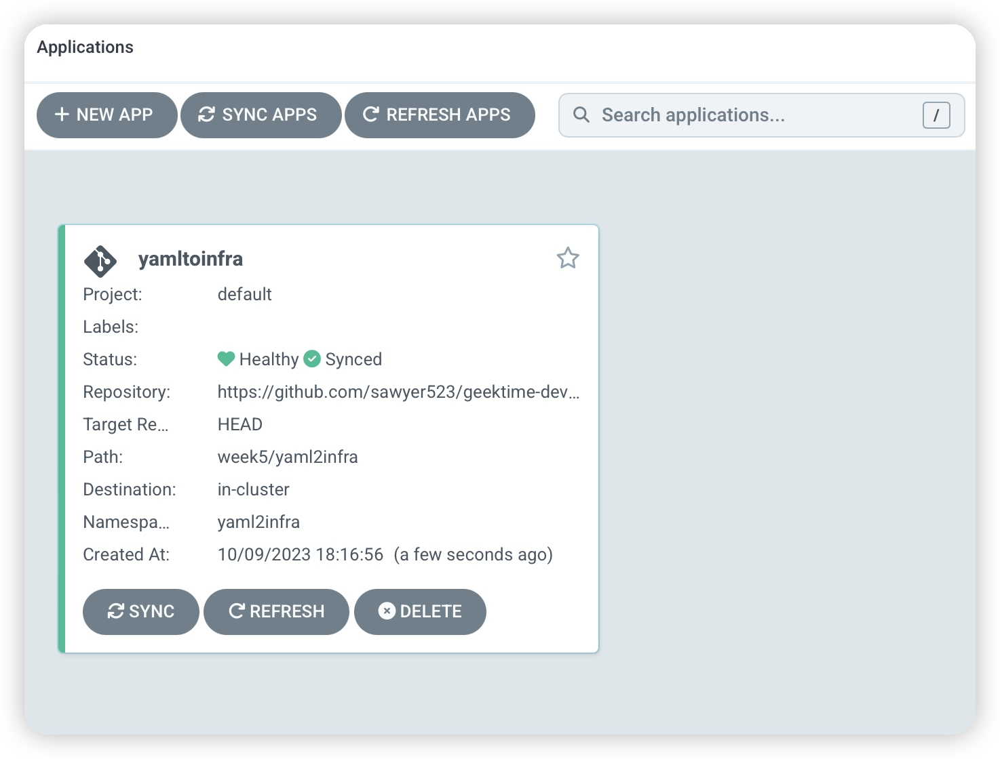
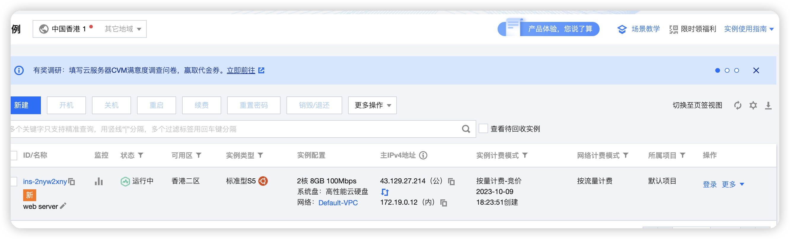

# Homework
实验全部基于本地 k8s 集群
## 使用 YAML to Infra 的模式创建腾讯云 Redis 数据库
在 redis 目录下
1. 安装 tencent provider
    ```shell
    kubectl apply provider.yaml -n crossplane-system
    ```
    
    执行
    ```shell
    kubectl get providers -n crossplane-system -w
    ```
    等待状态变成
    ```shell
    NAME                    INSTALLED   HEALTHY   PACKAGE                                                           AGE    
    provider-tencentcloud   True        True      xpkg.upbound.io/crossplane-contrib/provider-tencentcloud:v0.6.0   84s
    ```

1. 安装 providerConfig
    1. 前往 [https://console.cloud.tencent.com/cam](https://console.cloud.tencent.com/cam) 设置 APIKey
    2. 把 1 中的 secret_id, secret_key 复制到 secret.yaml 文件中
    3. 执行
    ```shell
    kubectl apply -f secret.yaml -n crossplane-system
    kubectl apply -f provider-config.yaml -n crossplane-system
    ```

1. 创建 vpc 和 subnet
    ```shell
    kubectl apply -f vpc.yaml -n crossplane-system
    kubectl apply -f subnet.yaml -n crossplane-system
    ```
    

1. 创建 redis
    执行
    ```shell
    kubectl -n crossplane-system get vpcs.vpc.tencentcloud.crossplane.io
    NAME        READY   SYNCED   EXTERNAL-NAME   AGE
    redis-vpc   True    True     vpc-o6t2ek0k    24m
    kubectl -n crossplane-system get subnets.vpc.tencentcloud.crossplane.io
    NAME           READY   SYNCED   EXTERNAL-NAME     AGE
    redis-subnet   True    True     subnet-qsy4x7bh   26m

    ```
    将上面创建的 vpc 和 subnet EXTERNAL-NAME 填入 redis.yaml 中的 subnetId 和 vpcId，执行 
    ```shell
    kubectl apply -f redis.yaml -n crossplane-system
    ```
    执行
    ```shell
    kubectl -n crossplane-system get instances.redis.tencentcloud.crossplane.io -w
    ```
    观察创建状态直到
    ```shell
    NAME           READY   SYNCED   EXTERNAL-NAME     AGE
    redis-subnet   True    True     subnet-qsy4x7bh   26m
    ```
    
    redis 创建完成

## 使用 CrossPlane + Terraform + Argo CD 实现作业 1 的效果

在 yaml2infra 目录下
已推送 cvm/cvm.yaml 至代码仓库
1. 安装 terraform provider
    ```shell
    kubectl apply provider.yaml -n crossplane-system
    ```
    
    执行
    ```shell
    kubectl get providers -n crossplane-system -w
    ```
    等待状态变成
    ```shell
    NAME                 INSTALLED   HEALTHY   PACKAGE                                              AGE
    provider-terraform   True        True      xpkg.upbound.io/upbound/provider-terraform:v0.10.0   19s
    ```

1.  安装 providerConfig
    1. 前往 [https://console.cloud.tencent.com/cam](https://console.cloud.tencent.com/cam) 设置 APIKey
    2. 把 1 中的 secret_id, secret_key 填写到 provider-config.yaml 文件中的 tencentcloud   对应的 secret_id,secret_key 中
    3. 执行
    ```shell
    kubectl apply -f secret.yaml -n crossplane-system
    kubectl apply -f provider-config.yaml -n crossplane-system
    ```

1. 部署 argocd 任务
    1. 创建 GitHub API Secret，填写在 github-repository.yaml 中的 password 中
    2. 部署
    ```shell
    kubectl apply -f github-repository.yaml
    kubectl apply -f application.yaml
    ```

1. 登陆 argocd 查看
     

1. 登陆 tencent 查看
    
