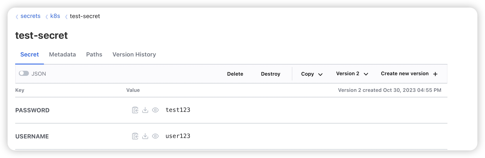

# week8 homework
## 请使用 external-secrets 将集群内已存在的 secret 推送到 Vault 中并截图
1. 先转发 vault 服务到本地，以便 vault cli 访问：kubectl port-forward svc/vault -n vault 8200:8200
1. export VAULT_ADDR='http://127.0.0.1:8200'
1. 初始化：vault operator init
   ```shell
   ❯ vault operator init
   ```
1. vault operator unseal <1,2,3> 用 3 个 token 解锁
    ```shell
    ❯ vault operator unseal <key1>
    Key                Value
    ---                -----
    Seal Type          shamir
    Initialized        true
    Sealed             true
    Total Shares       5
    Threshold          3
    Unseal Progress    1/3
    Unseal Nonce       1ccde5e4-6329-48be-76d1-3ba57873037e
    Version            1.15.1
    Build Date         2023-10-20T19:16:11Z
    Storage Type       file
    HA Enabled         false
    ❯ vault operator unseal <key2>
    Key                Value
    ---                -----
    Seal Type          shamir
    Initialized        true
    Sealed             true
    Total Shares       5
    Threshold          3
    Unseal Progress    2/3
    Unseal Nonce       1ccde5e4-6329-48be-76d1-3ba57873037e
    Version            1.15.1
    Build Date         2023-10-20T19:16:11Z
    Storage Type       file
    HA Enabled         false
    ❯ vault operator unseal <key3>
    Key             Value
    ---             -----
    Seal Type       shamir
    Initialized     true
    Sealed          false
    Total Shares    5
    Threshold       3
    Version         1.15.1
    Build Date      2023-10-20T19:16:11Z
    Storage Type    file
    Cluster Name    vault-cluster-28c5108e
    Cluster ID      b2be5bc5-14a9-11bc-b6b1-bb2f6cc7f9dd
    HA Enabled      false
    ```
2. 登录 vault UI：127.0.0.1:8200，使用输出的 token 登录
3. 创建 Policies，名称为 example，内容为
    ```json
    path "*" {
      capabilities = capabilities = ["create", "list", "read", "update"]
    }
    ```
4. 进入 Access 模块，点击”Enable new method“，选择 username/password 类型，点击”enable Method“
5. 进入新创建的 method，点击 create user 创建用户，用户名 example，密码 example，在 Generated Token's Policies 一栏，输入 example（刚才创建的 policy）
6. 选择右侧的 Secrets engines，在界面里创建新的 Secrets Engines，选择 KV，path 命名为: k8s
7. 然后切换刚才创建的用户登录 vault ui，example: exmaple, 点击头像，复制 token
8. 创建 secret：
    ```shell
    kubectl create secret generic vault-token \ 
        --from-literal=token='<token>'
    ```
9. 配置集群级级 secret store
    ```shell
    kubectl apply -f vault/secretstore.yaml 
    ```
10. 在 defatul namespace 下创建 secret
    ```shell
    kubectl create secret generic test-secret \
        --from-literal=PASSWORD=test123 \
        --from-literal=USERNAME=user123
    ```
11. 部署 pushsecret.yaml
    ```shell
    kubectl apply -f vault/pushsecret.yaml
    ```
12. vautl 上截图


##  使用 Kyverno 同步 default 命名空间下的镜像仓库凭据 docker-regcred Secret，实现创建新命名空间时自动创建该 Secret
1. 部署 ClusterPolicy 
    ```shell
    kubectl apply -f kyverno/sync-docker-regcred.yaml
    ```
1. 创建 docker-regcred Secret
    ```shell
    kubectl create secret docker-registry docker-regcred \
      --namespace=default \
      --docker-server=myregistry.company.com \
      --docker-username=mydockeruser \
      --docker-password=pa55w0rd
    ```
1. 创建新 namespace test-docker-regcred
    ```shell
    kubectl create ns test-docker-regcred
    ```
1. 查看 secret
    ```shell
    ❯ k get secret -n test-docker-regcred -o yaml
    apiVersion: v1
    items:
    - apiVersion: v1
      data:
        .dockerconfigjson: eyJhdXRocyI6eyJteXJlZ2lzdHJ5LmNvbXBhbnkuY29tIjp7InVzZXJuYW1lIjoibXlkb2NrZXJ1c2VyIiwicGFzc3dvcmQiOiJwYTU1dzByZCIsImF1dGgiOiJiWGxrYjJOclpYSjFjMlZ5T25CaE5UVjNNSEprIn19fQ==
      kind: Secret
      metadata:
        creationTimestamp: "2023-10-30T09:49:11Z"
        labels:
          app.kubernetes.io/managed-by: kyverno
          generate.kyverno.io/clone-source: ""
          generate.kyverno.io/policy-name: sync-secrets
          generate.kyverno.io/policy-namespace: ""
          generate.kyverno.io/rule-name: sync-docker-regcred-secret
          generate.kyverno.io/source-group: ""
          generate.kyverno.io/source-kind: Secret
          generate.kyverno.io/source-name: docker-regcred
          generate.kyverno.io/source-namespace: default
          generate.kyverno.io/source-version: v1
          generate.kyverno.io/trigger-group: ""
          generate.kyverno.io/trigger-kind: Namespace
          generate.kyverno.io/trigger-name: test-docker-regcred
          generate.kyverno.io/trigger-namespace: ""
          generate.kyverno.io/trigger-version: v1
        name: docker-regcred
        namespace: test-docker-regcred
        resourceVersion: "75273173"
        uid: b93c37fb-7639-4a4e-9eae-39e607418df6
      type: kubernetes.io/dockerconfigjson
    kind: List
    metadata:
      resourceVersion: ""
    ```