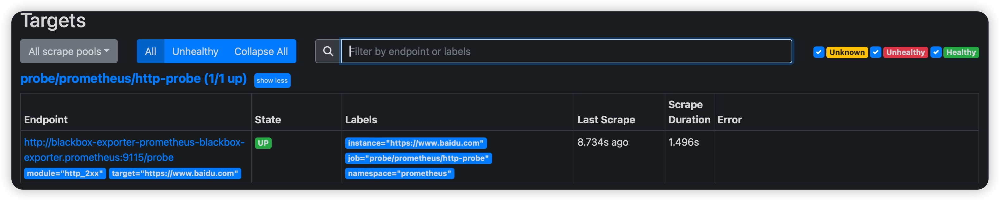
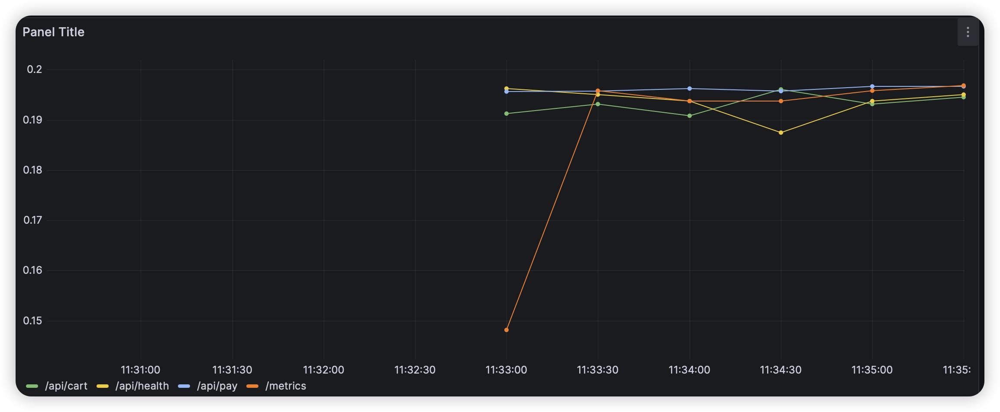
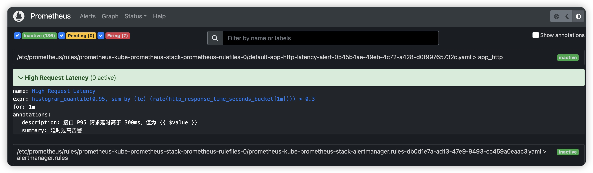

## 请编写 Probe 对象，实现对 http://baidu.com 黑盒监控，并在 Grafana Dashboard 展示
1. 部署 yaml 文件
```shell
kubectl -n prometheus apply -f probe.yaml
```
2. 登陆 prometheus 查看


# note
下面两个实验部署
* deployment.yaml
* service.yaml
* serviceMonitor.yaml

## 请从零构建一个 Grafana Dashboard:按 path 分组的 http_response_time_seconds_bucket 指标(1 分钟的平均) 的第 95 个百分位延迟的时间序列图
prometheus 查询语句
```promQL
histogram_quantile(0.95, sum(rate(http_response_time_seconds_bucket[1m])) by (le, path))
```


## 请编写一个 PrometheusRule:当请求 P95 的延迟时间大于 300ms 时告警

